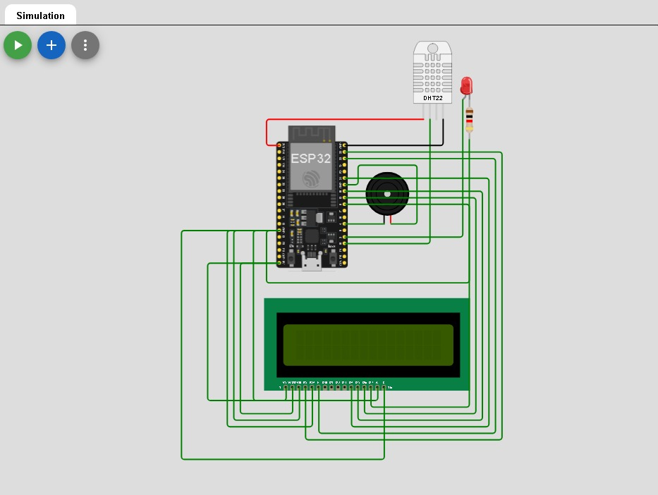
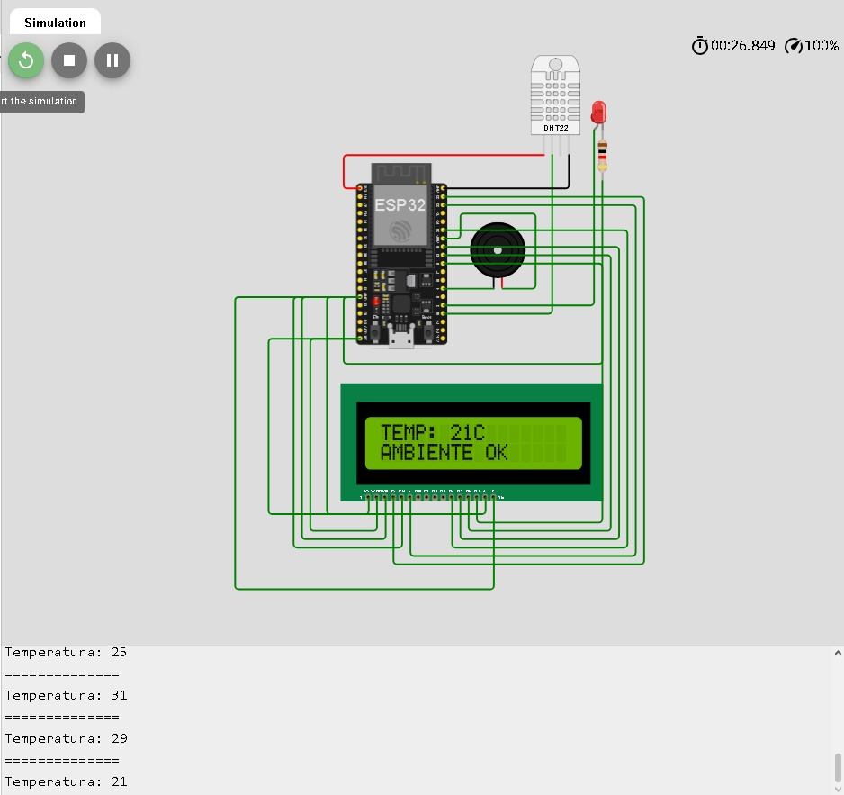
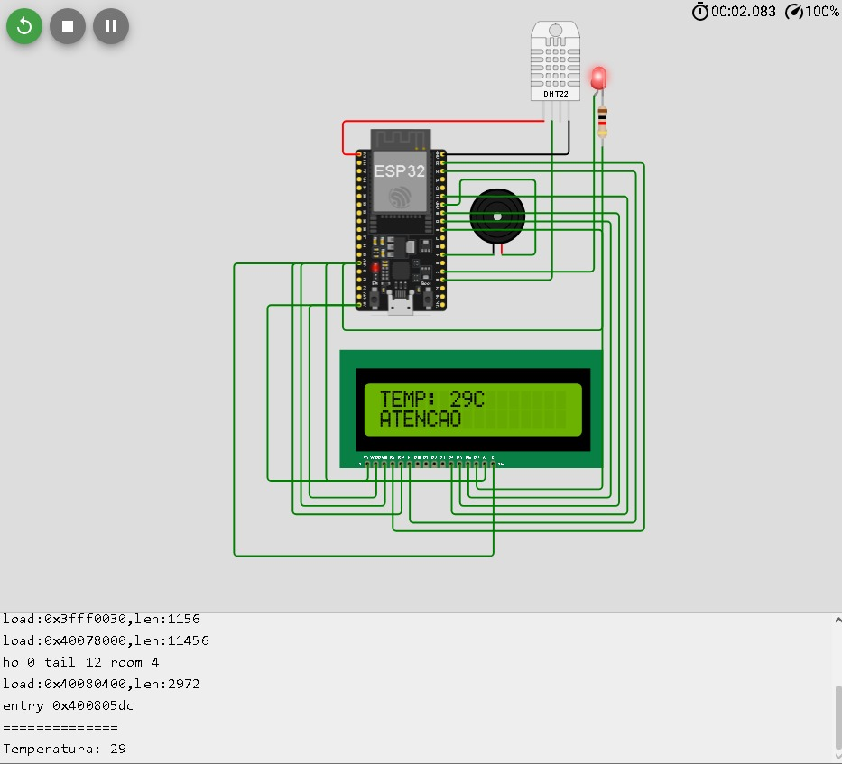
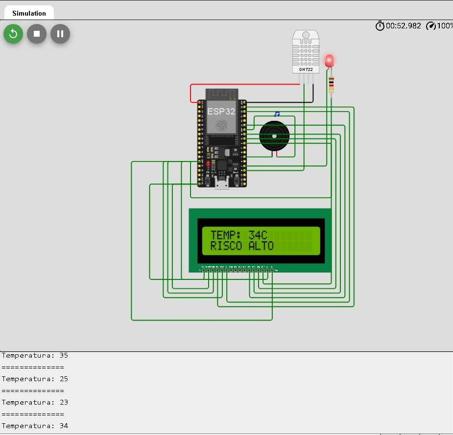

# SuperNovaVet 

##  Sobre o Projeto

O **SuperNovaVet** é um protótipo IoT desenvolvido para monitorar a temperatura do ambiente de pets, auxiliando na prevenção de riscos causados por calor excessivo.

O sistema realiza a leitura da temperatura e classifica o ambiente em níveis de segurança:

- Ambiente OK
- Atenção
- Risco Alto

Quando a temperatura atinge níveis críticos, o sistema ativa alertas visuais e sonoros.
O projeto completo do Wokwi pode ser baixado [aqui](wokwi_project/wifi-scan.zip)

---

#  Objetivo

Desenvolver uma solução simples utilizando conceitos de IoT para monitoramento preventivo de ambientes pets, demonstrando uma prova de conceito funcional.

---

#  Tecnologias Utilizadas

- ESP32
- Sensor DHT22
- LCD 16x2
- LED
- Buzzer
- Wokwi Simulator
- Linguagem C++ (Arduino)

---

#  Funcionamento

O sistema monitora a temperatura ambiente e reage conforme os valores detectados:

| Temperatura | Status |
|---|---|
| Abaixo de 28°C | Ambiente OK |
| Entre 28°C e 32°C | Atenção |
| Acima de 33°C | Risco Alto |

---

#  Alertas do Sistema

## Ambiente OK
- LCD informa ambiente seguro
- LED desligado
- Buzzer desligado

## Atenção
- LED ligado
- LCD informa atenção

## Risco Alto
- LED ligado
- Buzzer ativado
- LCD informa risco alto

---

#  Componentes Utilizados

- 1x ESP32
- 1x Sensor DHT22
- 1x LCD 16x2
- 1x LED Vermelho
- 1x Resistor 220Ω
- 1x Buzzer

---

# 📷 Demonstração do Projeto

## Circuito Completo



---

## Ambiente OK



---

## Atenção



---

## Risco Alto



---

#  Trecho do Código

```cpp
if (temperatura < 28) {

  lcd.print("AMBIENTE OK");

}
else if (temperatura < 33) {

  lcd.print("ATENCAO");

}
else {

  lcd.print("RISCO ALTO");
}
```

---

#  Simulação

O projeto foi desenvolvido e testado utilizando o simulador Wokwi.

---

# Estrutura do Projeto

```text
supernovavet-iot/
│
├── codigo/
│   └── main.ino
│
├── imagens/
│   ├── CIRCUITO.jpeg
│   ├── AMBIENTE_OK.jpeg
│   ├── ATENCAO.jpeg
│   └── RISCO_ALTO.jpeg
│
└── README.md
```

---

#  Integrantes

- Felipe Augusto Lopes Ferreira
- Kaique Mascarenhas dos Santos

---

#  Disciplina

Disruptive Architectures: IoT, IoB & Generative IA
